Hey, I'm Sadik. I build websites and web apps out of Delhi, mostly with Next.js and React, sometimes Astro, and a fair bit of PHP and WordPress when a project needs it.
 
Lately I've been spending a lot of time with AI coding tools and building small things around them.
 
**What I usually reach for:** TypeScript, React, Next.js, Astro, Node.js, Tailwind, shadcn/ui, MUI, PHP, WordPress.
